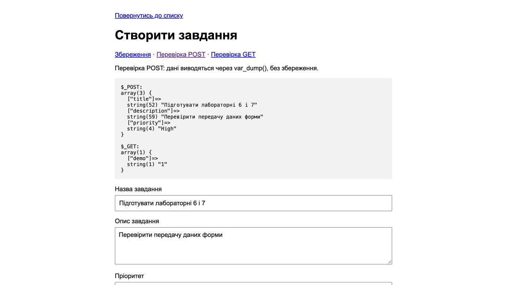
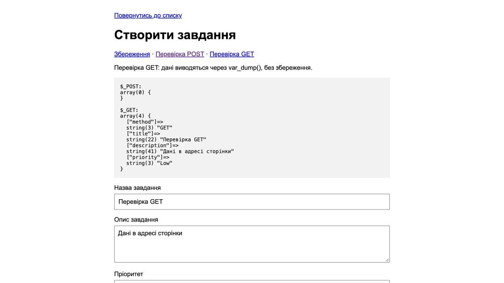

# Лабораторна робота №6

**Студент:** Сілков Нікіта  
**Тема:** HTML-форми. Передача даних методами GET та POST.

## Мета

Створити форму додавання завдання, прийняти дані в PHP та порівняти GET і POST.

## Хід роботи

У `create.php` додано поля `title`, `description`, `priority` і кнопку «Зберегти». Зі списку завдань можна перейти до форми та повернутися назад. За звичайного відкриття форма має `action="create.php"` і `method="POST"`.

Оскільки лабораторні 6 і 7 виконані разом, для перевірки передачі даних залишено посилання «Перевірка POST» та «Перевірка GET». У цих режимах дані лише виводяться, а файл завдань не змінюється. У звичайному режимі працює перевірка і збереження з лабораторної №7.

### Код форми

```php
    <form action="<?= $method === 'GET' ? 'create.php' : ($isDemo ? 'create.php?demo=1' : 'create.php') ?>" method="<?= escape($method) ?>">
        <?php if ($method === 'GET'): ?>
            <input type="hidden" name="method" value="GET">
        <?php endif; ?>
        <label for="title">Назва завдання</label>
        <input type="text" id="title" name="title" value="<?= escape($title) ?>">
        <label for="description">Опис завдання</label>
        <textarea id="description" name="description" rows="4"><?= escape($description) ?></textarea>
        <label for="priority">Пріоритет</label>
        <select id="priority" name="priority">
            <option value="">Оберіть пріоритет</option>
            <?php foreach (['Low', 'Medium', 'High'] as $option): ?>
                <option value="<?= $option ?>" <?= $priority === $option ? 'selected' : '' ?>><?= $option ?></option>
            <?php endforeach; ?>
        </select>
        <button type="submit">Зберегти</button>
    </form>
```

### Приймання даних

`$_SERVER['REQUEST_METHOD']` визначає метод запиту. Для POST використовується `$_POST`, для навчального GET — `$_GET`. У режимі перевірки результат формується так:

```php
        ob_start();
        echo "\$_POST:\n";
        var_dump($_POST);
        echo "\n\$_GET:\n";
        var_dump($_GET);
        $dump = ob_get_clean();
```

Виведення у HTML:

```php
<pre><?= escape($dump) ?></pre>
```

Функція `escape()` використовує `htmlspecialchars()`, щоб введений HTML не виконувався в браузері навіть під час налагодження.

### Результат POST

Заповнено назву, опис і пріоритет High. У `$_POST` отримано три ключі з відповідними значеннями. Дані форми відсутні в адресі сторінки. У `$_GET` залишається лише службовий параметр `demo=1`.



### Результат GET

У режимі GET поля передаються в адресі сторінки: `create.php?method=GET&title=...&description=...&priority=Low`. Кирилиця в URL кодується. Масив `$_POST` порожній, а `$_GET` містить поля форми та параметр вибору режиму.



## Відповіді на контрольні запитання

1. **Три відмінності GET і POST.** GET передає параметри в URL, POST — у тілі запиту. GET призначений для отримання даних, POST — для надсилання даних на обробку, наприклад створення завдання. Посилання GET можна зберегти в закладках разом із параметрами; тіло POST у закладку не потрапляє. Практичні обмеження розміру URL для GET залежать від браузера та сервера, а для POST — від налаштувань сервера, зокрема `post_max_size`.
2. **Коли потрібен GET і чому він не підходить для паролів?** GET зручний для пошуку, фільтрів і номерів сторінок. URL може залишитися в історії, журналах сервера або скопійованому посиланні. Тому паролі передають через POST із HTTPS. Сам POST не шифрує дані.
3. **Для чого `action`?** Атрибут задає адресу обробника форми. `action="create.php"` надсилає поля до цієї сторінки.
4. **Як `name` пов’язаний із PHP?** Значення атрибута стає ключем масиву: `name="title"` відповідає `$_POST['title']`. Самого `id` для передачі поля недостатньо.
5. **Для чого `var_dump()` і `<pre>`?** `var_dump()` показує типи та значення, а `<pre>` зберігає відступи й перенесення рядків. Довжина `string(...)` у PHP рахується в байтах, тому для кирилиці вона може відрізнятися від кількості символів. Такий вивід потрібен під час перевірки, а у звичайному режимі роботи прихований.

## Висновок

Форма передає значення полів до PHP. Перевірено обидва методи й отримані масиви. POST використано для додавання завдань, GET залишено окремим навчальним режимом.

[Умова роботи](https://surkovkostiantyn.github.io/nmk/programming/lab_06.html) · [Приклад викладача](https://github.com/SurkovKostiantyn/kn25ipz25/tree/main/lab6_7)
