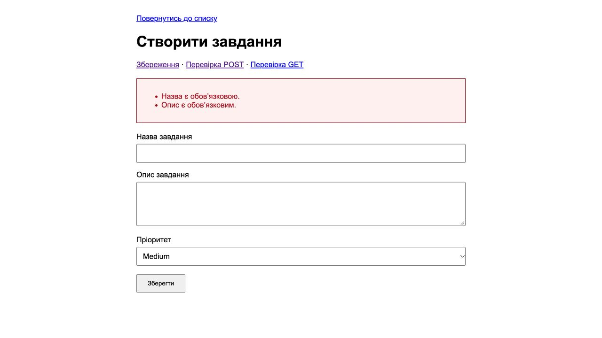
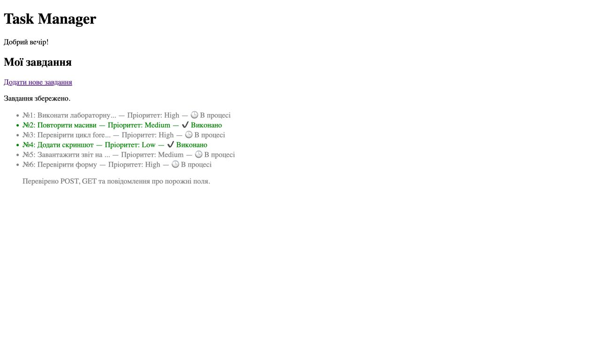

# Лабораторна робота №7

**Студент:** Сілков Нікіта  
**Тема:** Валідація даних форми та безпечне виведення.

## Мета

Перевірити дані на сервері, показати всі помилки над формою і зберегти введені значення після невдалого надсилання.

## Хід роботи

Форму з лабораторної №6 доповнено масивом `$errors`. Назва й опис очищуються від крайніх пробілів через `trim()` та перевіряються на порожній рядок. Пріоритет має належати до Low, Medium або High. Також перевіряється, що замість рядків не передано масиви.

У звичайному режимі обробка виконується після POST. У демонстраційному режимі GET ці самі перевірки дозволяють порівняти передачу даних без збереження.

### Код перевірки

```php
$errors = [];
$submitted = $_SERVER['REQUEST_METHOD'] === 'POST' || ($method === 'GET' && isset($_GET['title']));
if ($submitted) {
    $input = $_SERVER['REQUEST_METHOD'] === 'POST' ? $_POST : $_GET;
    foreach (['title', 'description', 'priority'] as $field) {
        if (isset($input[$field]) && !is_string($input[$field])) {
            $errors[] = 'Некоректний формат поля ' . $field;
        }
    }
    $title = trim(is_string($input['title'] ?? null) ? $input['title'] : '');
    $description = trim(is_string($input['description'] ?? null) ? $input['description'] : '');
    $priority = trim(is_string($input['priority'] ?? null) ? $input['priority'] : '');
    if ($title === '') {
        $errors[] = 'Назва є обов’язковою.';
    }
    if ($description === '') {
        $errors[] = 'Опис є обов’язковим.';
    }
    if (!in_array($priority, ['Low', 'Medium', 'High'], true)) {
        $errors[] = 'Оберіть пріоритет Low, Medium або High.';
    }
}

```

### Безпечний вивід помилок

```php
function escape($value)
{
    return htmlspecialchars($value, ENT_QUOTES | ENT_SUBSTITUTE, 'UTF-8');
}
```

```php
<div class="alert-danger" role="alert">
    <ul>
        <?php foreach ($errors as $error): ?>
            <li><?= escape($error) ?></li>
        <?php endforeach; ?>
    </ul>
</div>
```

Блок виводиться лише коли `$errors` не порожній. Він розташований перед формою і має червоний текст, рамку та світло-червоне тло. Введені назва й опис повертаються у поля через `escape()`, а вибраний пріоритет — через `selected`.

### Перевірка порожніх полів

Вибрано Medium, назву та опис залишено порожніми. Після надсилання сервер показав обидві помилки над формою. Атрибут `required` не встановлювався, щоб перевірити саме серверну валідацію.



### Збереження правильних даних

Якщо помилок немає, завдання додається до `data.json`, після чого сервер повертає перенаправлення 303 на список. Оновлення списку не повторює POST. Початкові п’ять завдань збережено; нове має номер 6. Читання та запис використовують файлове блокування.

У JSON зберігається очищений текст без HTML-кодування. `htmlspecialchars()` застосовується під час виведення у форму, список і блок налагодження. Це захищає HTML-контекст і не створює подвійного кодування амперсандів.



### Результати перевірок

- Порожні рядки та рядки з пробілів не зберігаються.
- При порожньому описі назва і вибраний пріоритет залишаються у формі.
- Невідомий пріоритет, відсутні поля та масив замість тексту відхиляються.
- Текст `<script>alert(1)</script>` відображається як текст, а не виконується.
- Правильний POST додає один запис; повторне відкриття списку не створює копію.
- Значення `0` не вважається порожнім рядком.
- Режими перевірки GET і POST не змінюють JSON.
- Пошкоджений JSON не перезаписується новими даними.

## Відповіді на контрольні запитання

1. **Frontend і backend валідація.** Frontend перевіряє поля в браузері, наприклад через `required` або JavaScript. Backend перевіряє отриманий запит у PHP. Перша допомагає швидше виправити помилки, друга захищає обробку даних на сервері.
2. **Чому перевірки браузера недостатньо?** Атрибут `required` можна прибрати в інструментах розробника або надіслати HTTP-запит без форми. Сервер не повинен покладатися на те, що перевірку вже виконав браузер.
3. **Що робить `trim()`?** Прибирає пробіли та інші визначені PHP пробільні символи з початку й кінця рядка. Рядок із самих звичайних пробілів стає порожнім. Для назви завдання це зручно; правила для логіна залежать від вимог, а пароль не слід непомітно змінювати через `trim()`.
4. **Для чого `htmlspecialchars()`?** Перетворює спеціальні HTML-символи на сутності. Наприклад, `<script>` стає `&lt;script&gt;`, тому браузер показує введений текст. У цьому проєкті функція використовується для HTML-тексту та значень полів; вона не замінює перевірку даних або захист SQL-запитів.
5. **Навіщо масив помилок замість `die()`/`exit()`?** У масив можна зібрати всі недоліки й показати їх разом, залишивши форму та введені значення. Користувачу не доведеться виправляти по одній помилці після кожного надсилання. `exit` після успішного перенаправлення лише завершує відповідь сервера.

## Висновок

Додано серверну валідацію, спільний блок помилок і збереження введених значень. Правильне завдання потрапляє до JSON та списку, некоректне — залишається у формі для виправлення.

[Останній коміт роботи](https://github.com/nikitauroboros-cpu/SilkovNikitaKNK25/commits/main/phpsilkov25/)  
[Умова роботи](https://surkovkostiantyn.github.io/nmk/programming/lab_07.html) · [Приклад викладача](https://github.com/SurkovKostiantyn/kn25ipz25/tree/main/lab6_7)
